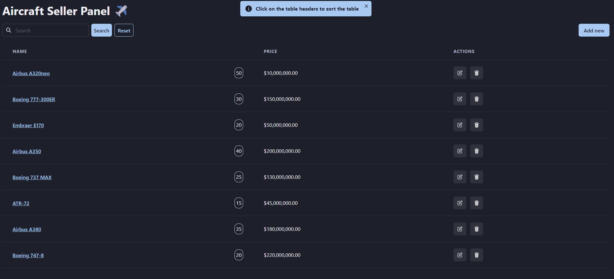

# Fullstack aircraft seller panel - frontend

This is the frontend part of the application, which sends requests to the API at the address task.loc. This address will be available locally after the installation and launch of the [backend part](https://github.com/alexbulgakov/aircraft-seller-panel-full-back) of the application. For full functionality, both the frontend and backend must be running simultaneously on the local machine.

The application is a table with a list of airplanes that allows for searching, editing, and adding new ones. Forms have validation, and the search is synchronized with the URL.

## Table of contents

- [Overview](#overview)
  - [The challenge](#the-challenge)
  - [Screenshot](#screenshot)
  - [Links](#links)
  - [How to install](#how-to-install)
- [My process](#my-process)
  - [Built with](#built-with)

## Overview

### The challenge

Users should be able to:

- search through the list of airplanes
- sort by clicking on the column header
- edit airplane information
- add an airplane
- view information about the airplane by clicking on its name
- delete an airplane from the list

### Screenshot



### Links

- Solution URL: [github.com/alexbulgakov/aircraft-seller-panel](https://github.com/alexbulgakov/aircraft-seller-panel)
- Live Site URL (without backend): [aircraft-seller-panel.vercel.app/](https://aircraft-seller-panel.vercel.app/)

### How to install

For local installation, you need to run the following command in the terminal of the project directory:

```bash
npm install
```

To start in development mode, you need to run the command:

```bash
npm run dev
```

## My process

### Built with

- [Chakra UI](https://chakra-ui.com/) - This is a library of adaptive React components for building web applications
- [React](https://reactjs.org/) - JS library
- [Redux](https://redux.js.org/) - State manager
- [TypeScript](https://www.typescriptlang.org/)
- [Feature Sliced Design](https://feature-sliced.design/) - Architectural methodology for frontend projects
- [Yup](https://github.com/jquense/yup) - Dead simple Object schema validation
